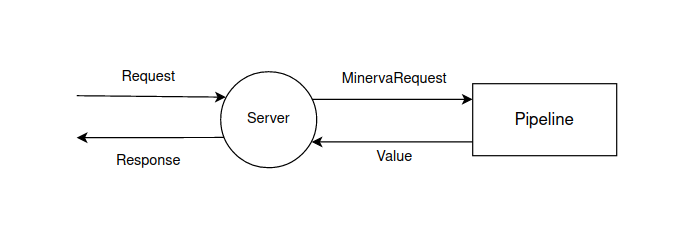

<div align="center">

**Languages:**
  
[](README.md)
[](README.ru.md)

</div>

- [Introduction](#introduction)
- [About Minerva](#about-minerva)
- [Ecosystem](#ecosystem)
- [Installing](#installing)
- [CLI](#cli)
  - [Create project](#create-project)
  - [Build project](#build-project)
  - [Run project](#run-project)
  - [Debug](#debug)
    - [VS Code](#vs-code)
  - [Testing](#testing)
  - [Docker](#docker)
- [Project configuration](#project-configuration)
- [Framework structure](#framework-structure)
  - [Components](#components)
- [Routing](#routing)
  - [Pipeline](#pipeline)
  - [Endpoints](#endpoints)
    - [Api](#api)
    - [Request body](#request-body)
      - [FormData](#formdata)
    - [Path parameters](#path-parameters)
    - [Request filter](#request-filter)
    - [Websockets](#websockets)
- [Authentication](#authentication)
  - [JWT](#jwt)
  - [Cookie](#cookie)
- [Middlewares](#middlewares)
  - [Ready-made middlewares](#ready-made-middlewares)
  - [Custom middlewares](#custom-middlewares)
- [Static files](#static-files)
- [Dependency injaction](#dependency-injaction)
- [Agents](#agents)
  - [Custom agents](#custom-agents)
- [Logging](#logging)
  - [Pipeline](#pipeline-1)
  - [Ready-made loggers](#ready-made-loggers)
    - [Logging templates](#logging-templates)
    - [Logging to files](#logging-to-files)
  - [Logging configuration](#logging-configuration)
  - [Custom loggers](#custom-loggers)
- [Configuration manager](#configuration-manager)
- [Password hashing](#password-hashing)
- [Road map](#road-map)

# Introduction

I decided to start writing my own server framework due to the fact that most of the major server frameworks in Dart are no longer supported (`Aqueduct`, `Angel` and others).

When creating the framework, I wanted it to work with both `JIT` and `AOT` compilation types, that is, it should not have used `dart:mirrors`, which greatly affected the implementation of many things. I do not rule out writing separate packages for the ecosystem of this framework in the future, which will be based on `dart:mirros` or on `build_runner`. But if they are based on `dart:mirros`, they will act as separate packages, and not be part of the main framework.

In other server frameworks, I liked the presence of configuration files in the project, as well as the build system (I was inspired by part of it ASP.NET ). Therefore, this framework has a project build system, and several build modes: `debug` and `release`. Also, within each build, you can choose the type of compilation: `JIT` or `AOT`. Along with the package comes a `CLI` utility for this.

The utility supplied by the `CLI` also has the ability to generate a `docker` file, which seemed to me a convenient thing.

I created this framework with the expectation of getting the most out of using isolates when processing requests. I also tried to solve the problems that can be encountered when using isolates when building a server.

Many components of the framework, such as intermediate request handlers, logging tools and other components, allow you to write your own, custom components for your needs.

Write me your opinion about this framework, report errors or inaccuracies, illogicalities. I really want to know your opinion.

# About Minerva

# Ecosystem

Various packages to simplify working with `Minerva`, as well as in general that simplify writing server applications on `Dart`, are likely to be released as separate packages.

Currently existing my packages that may be useful to you:
  - [emerald](http://pub.dev/packages/emerald) - `JSON` serializer/deserializer, based on `dart:mirrors`, works only with `JIT` compilation type.

# Installing

# CLI

The framework contains the `CLI` utility `Minerva`, which contains the following commands:

- `create` - creates a project with a standard template;
- `build` - builds the project according to the current parameters set in the app setting.json file of the project;
- `clear` - clears the project build;
- `run` - starts the project, if there is no project assembly, then pre-starts the assembly;
- `debug` - runs the project with `VM` services for debugging, the compilation type of the launched assembly should be `JIT`;
- `test` - starts the server, runs the tests, after the tests completes the server process;
- `docker` - generates `Dockerfile`.

## Create project

To create a project with a standard template, the `CLI` utility `Minerva` contains the `create` command.

The command contains a mandatory parameter `name`, which specifies the name of the project to be created.

Using the `directory` parameter you can specify the project creation directory.

Using the `debug-compile-type` and `release-compile-type` parameters, you can specify compilation types for `debug` and `release` project build types. You can change them at any time in the `app setting.json' file.

Using the `docker-compile-type` parameter, you can specify the compilation type for which `Dockerfile` will be generated. You can generate the `Dockerfile` again at any time using the `docker` command.

## Build project

Building a project in `Minerva` assumes the presence of two types of project assembly:

- `debug` - for debugging and project development;
- `release` - for final deployment.

When creating a project, an `app setting.json` file is created in its root. This is the main configuration file of the project.

## Run project

The project is launched using the `run` command, as well as by running the executable file in the /build/`build type`/bin folder (for `JIT` compilation it is `kernel snapshot`, and for `AOT` it is `exe` file) manually. When developing, it is preferable to run the project using the `run` command, since it also involves the automatic assembly of the project.

## Debug

Debugging is only available using `JIT` compilation. To run the application in debug mode, use the `debug` command.

### VS Code

To start debugging in the VS Code editor, you must create a `launch.json` file and specify the `program` parameter in the `configuration`. In the `program` parameter, you specify the path to the executable file. For `JIT` compilation, `Minerva` creates a `kernel snapshot`, it is stored at the path build/`build type`/bin/main.dll . Example path: `build/debug/bin/main.dill`.

## Testing

Testing is started using the `test` command. Testing involves starting the server, running all tests, and completing the server process.

When building a project, a file `test_app_setting.g.dart` is generated in the `test` folder. It stores the port and address that the server uses during the current build. This is done for convenience, so that when you start tests, you can access the settings relevant to the current project build from the `appsetting.json` file.

## Docker

When creating a project using the `create` command, a `Dockerfile` is generated for the given compilation type.

Docker files differ for different types of compilation. There are 2 docker file templates:

- `LIVE`;
- `AOT`.

You can re-generate the docker file with the selected compilation type at any time using the `docker` command. The compilation type is set by the `compile-type` parameter, by default it is `AOT`.

When generating the docker file, the assets added to the final build of the project from the `app setting.json` file are also taken into account. Therefore, after adding them, you must either generate the `Dockerfile` again, or edit the `Dockerfile` manually.

# Project configuration

Each 'Minerva' project contains a configuration file `appsetting.json'. This file contains the settings for the `debug` and `release` assemblies of the project, and also allows you to embed values and arbitrary files into the final assembly of the project.

The `appsetting.json` file contains the `debug` and `release` fields, which contain configuration details of the corresponding project assemblies.

In them you can configure:

- `host` - the address where the server is started. By default, for `debug` it is `127.0.0.1`, and for `release` it is `0.0.0.0`;
- `port` - the port on which the server is started. By default, for `debug` it is `5000`, and for `release` it is `8080`;
- `compile-type` - the type of compilation of the project. Can be either `JIT` or `AOT`;
- `values` - values embedded in the assembly. You can access them using [configuration manager](#configuration manager);
- `logging` - logging configuration. You can read more about it [here](#configuration-logging).

Also, `appsetting.json' can contain general settings for all types of project builds.:

- `values` - values embedded in the assembly. You can access them using [configuration manager](#configuration manager);
- `assets` - by specifying assets, you can embed arbitrary files into the project assembly. The path to them is set relative to the project folder.

Example of specifying a list of assets:

```dart
"aseets": [
  "/wwwroot",
  "some_file.txt"
]
```

# Framework structure

The `Minerva` structure was created taking into account the possibility of processing requests in many isolates, to improve performance. Multithreaded request processing is implemented by running a server instance in multiple isolates, using the `shared` parameter.

The server structure can be represented as follows:

<div align="center">
  
</div>

Using the `instance` parameter of the `MinervaSetting` class, you can set the number of isolates in which server instances will be started.

Isolates used by the server are divided into 2 types:

- `server instances`;
- `agents`.

If everything is clear with server instances, these are isolates where the server instance is launched, then what are agents?

Running server instances in different isolates imposes some limitations and inconveniences. For example, you have a database connection, but if we run the server in several isolates, then each of the running server instances must have its own connection. This may not always be convenient, there may be different scenarios for using something like this. Or, for example, we should have some kind of common state between all `server instances`. That's why there are agents in `Minerva`.

An `agent` is a separate isolate that can store a certain state, receives messages with certain actions that it can perform.

All server instances can access and interact with one `agent`.

Then the scheme of the server operation can be represented as follows:

<div align="center">
  
</div>

Of course, the fact that the `agent` is executed in a separate isolate hits performance, due to losses in the transmission of messages between isolates. However, it can be a useful tool in specific scenarios.

You can read more about the agents [here](#agents).

## Components

During the server configuration process, you can set intermediate [request handlers] (#intermediate-handlers), [loggers] (#logging), [api](#api). All of them are called components. 

`Components` are entities that have their own life cycle.

The components include:

- `middlewares`;
- `loggers`;
- `api`.

From their life cycle, we can distinguish the presence of the `initialize` method, which is responsible for deferred initialization. During the server configuration process, you create component instances and pass them to Minerva. However, in fact, server instances work in other isolates, and Send/Receive ports impose restrictions on the transfer of certain types of data between isolates. Therefore, there is an `initialize` method in the `components`, which is triggered after transferring them to specific isolates where they will be used.

Deferred initialization can be used to open a connection to some external source. For example, it can be a custom logger that sends logs to another server and it must initialize the connection when the server starts.

# Routing

In Minerva, request routing is based on pipelined request processing. When configuring the server, middlewares are set that participate in the processing of the received request. You can read more about middlewares [here](#intermediate-handlers).

Request routing in `Minerva` can be represented as:

<div align="center">
  
</div>

## Pipeline

The request processing pipeline consists of middlewares. In this section, only some of them will be given, about the rest, as well as about the way to create your own middlewares, you can read [here](#intermediate-handlers).

The operation scheme of the request processing pipeline can be represented as follows:

<div align="center">
  
</div>

## Endpoints

Endpoints are used to process requests. Each endpoint has its own address. Endpoint processing returns `dynamic'. 

Endpoints are configured using classes derived from the MinervaEndpointsBuilder class.

There are several scenarios of how `Minerva` interprets the endpoint result before sending a response:

- if you returned `Map<String, dynamic>`, then `Minerva` will send a response with the code `200` and interpret your response as `json`;
- if you have returned an instance of the `Result` class, then `Minerva` will send a response with the settings specified in the `Result` instance;
- if you return any other type, then `Minerva` will bring it to a string (using the `toString` method) and send a response with the code `200'.

`Result` is an auxiliary class for configuring the response code, its headers and body. 'Minerva` contains ready-made result templates:

- `OkResult` - sends a response with the code `200`;
- `BadRequestResult` - sends a response with the code `400`;
- `UnauthorizedResult` - sends a response with the code `401`;
- `InternalServerErrorResult` - sends a response with the code `500`;
- `JsonResult` - implies sending `json`, by default has the status code `200`;
- `NotFoundResult` - sends a response with the code `404`;
- `FileResult` - implies sending a file for download;
- `FilePathResult` - implies sending a file for download, allows you to specify the path to the file. The path to the file can be set both absolutely and relative to the project folder;
- `FileContentResult` - implies sending the contents of the file;
- `FilePathContentResult` - implies sending the contents of the file. The path to the file can be set both absolutely and relative to the project folder;
- `RedirectionResult` - sends a response with the code `301` and a resource to redirect the request to.

Example of using the MinervaEndpointsBuilder class to configure endpoints:

```dart
class EndpointsBuilder extends MinervaEndpointsBuilder {
  @override
  void build(Endpoints endpoints) {
    endpoints.get('/hello', (context, request) {
      return 'Hello, world!';
    });
  }
}
```

One of the middlewares supplied with `Minerva` is `EndpointMiddleware`, this handler should be the last in the pipeline. It is he who is responsible for matching the incoming request with the specified endpoints.

### Api

Configuring endpoints individually can be inconvenient if the endpoints need to have some common context. As a general context, there may be dependencies that you have set using dependency injection.

An `Api` is a collection of endpoints, with some common context. Their configuration is carried out using classes derived from the MinervaApisBuilder class.

Example of creating a HelloApi, using the MinervaApisBuilder class to configure the api:

```dart
class HelloApi extends Api {
  @override
  void build(Endpoints endpoints) {
    endpoints.get('/hello', _hello);
  }

  dynamic _hello(ServerContext context, MinervaRequest request) {
    return 'Hello, world!';
  }
}

class ApisBuilder extends MinervaApisBuilder {
  @override
  List<Api> build() {
    var apis = <Api>[];

    apis.add(HelloApi());

    return apis;
  }
}
```

### Request body

You can access the request body through the `body` field of an instance of the `Minerva Request` class. The 'body` field provides access to an instance of the 'RequestBody' class.

Initially, it is represented as bytes (the `data` field), but there are methods for trying to represent it as:

- `text`. To do this, use the `as Text` method;
- `json`. The `asJson` method is used for this;
- `form`. To do this, use the `as Form` method.

#### FormData

The `as Form` method of an instance of the `Request Body` class returns `Future`, which will return an instance of the `Form Data` class.

An instance of the `Form Data` class contains the `data` field. This is `Map<String, Form Data Value>` where `String` is the name of the form field, and `Form Data Value` can be of 2 types:

- `Form Data String` is a form field representing a value in the form of a string;
- `Form Data File` is a form field containing a file.

### Path parameters

The path to the endpoint in `Minerva` can contain parameters of the form: `/user/:id`. During the search for the endpoint for the received path, the matching of the path path to the specified parameter template is performed.

You can access the values of the path parameters using the `pathParameters` field of an instance of the `MinervaRequest` class.

The path parameter template can also contain its type, the type can be `int` or `double`. Example of a path parameter task with type indication: `/user/int:id`.

The path parameter template can also contain a regular expression. Example of a path parameter task specifying a regular expression: `/user/:id([0-9])`.

Example of creating an endpoint with path parameters, using path parameters:

```dart
class EndpointsBuilder extends MinervaEndpointsBuilder {
  @override
  void build(Endpoints endpoints) {
    endpoints.get('/user/int:id', (context, request) {
      var id = request.pathParameters['id'];

      return 'User with id: $id.';
    });
  }
}
```

### Request filter

In `Minerva` you can set a query filter that will check the `content-type`, the presence of path parameters/fields in json/fields in form, as well as their compliance with certain data types. If the request does not match the filter, then you will not get an error of data non-compliance, `Minerva` will assume that the endpoint is not suitable for processing the request, if there are no endpoints capable of processing requests, you will get an error `404`.

The filter is set using the optional `filter` parameter when creating an endpoint.

Available filtering types:

- checking the `content-type` header;
- checking query parameters, their names, and data types;
- checking the request body for whether it is json, checking the names of json fields, as well as data types;
- checking the request body for whether it is a form, checking the names of form fields, as well as data types.

Example of using a query filter, filtering queries by the presence of a query parameter and matching its data type int:

```dart
class EndpointsBuilder extends MinervaEndpointsBuilder {
  @override
  void build(Endpoints endpoints) {
    endpoints.get('/user', (context, request) {
      var id = request.uri.queryParameters['id'] as int;

      return 'User with id: $id.';
    },
        filter: Filter(
            queryParameters: QueryParametersFilter(parameters: [
          QueryParameter(name: 'id', type: QueryParameterType.int)
        ])));
  }
}
```

### Websockets

In `Minerva` you can create endpoints for processing websocket connections.

Requests involving web socket connections are not processed in the request processing pipeline, but are immediately compared with endpoints.

Example of creating an endpoint for processing a web socket connection:

```dart
class EndpointsBuilder extends MinervaEndpointsBuilder {
  @override
  void build(Endpoints endpoints) {
    endpoints.ws('/hello', (context, socket) async {
      socket.add('Hello, world!');

      await socket.close();
    });
  }
}
```

# Authentication

`Minerva` contains auxiliary tools for working with JWT authentication, as well as authentication by session cookies.

## JWT

When creating an endpoint in `Minerva` using the optional `authOptions` parameter, you can set the `JWT` settings for this endpoint.

The `JWT` settings are set using the `JwtAuthOptions` class, the very existence of an instance of the `JwtAuthOptions` class will assume that the user has successfully completed authentication.

Also in the `JwtAuthOptions' class you can set:

- `roles`. Roles, one of which must correspond to the user role;
- `permission Level`. Roles can contain a `permission Level`, this is the access level. Allows you to configure access to endpoints more flexibly.

Example of creating an endpoint with the specified JWT authentication settings:

```dart
class EndpointsBuilder extends MinervaEndpointsBuilder {
  @override
  void build(Endpoints endpoints) {
    endpoints.get('/user/:id', (context, request) {
      var id = request.pathParameters['id'];

      return 'User with id: $id.';
    }, authOptions: AuthOptions(jwt: JwtAuthOptions(roles: ['User'])));
  }
}
```

`Minerva` contains a ready-made intermediate handler for `JWT` authorization - `JwtAuthMiddleware`. In the pipeline of intermediate request handlers, it should go earlier than `Endpoint Middleware'.

When creating an instance of `JwtAuthMiddleware`, you must set the required parameter `tokenVerify`. This is a handler where you prescribe the logic of checking the token for validity and must return `true` if the user is authorized, `false` if the user is not authorized.

`Minerva` does not contain built-in tools for working with `JWT` tokens due to the availability of ready-made third-party packages for this.

When creating an instance of `JwtAuthMiddleware`, you can set the `getRole` parameter. This is a handler where you prescribe the logic of getting a role from a token. The handler should return an instance of the `Role` class, specifying the role name. You can also set the `permission Level` for the role in.

Example of adding `Endpoint Middleware` to the request processing pipeline:

```dart
class MiddlewaresBuilder extends MinervaMiddlewaresBuilder {
  @override
  List<Middleware> build() {
    var middlewares = <Middleware>[];

    middlewares.add(ErrorMiddleware());

    // Adds middleware for working with JWT.
    middlewares
        .add(JwtAuthMiddleware(tokenVerify: tokenVerify, getRole: getRole));

    middlewares.add(EndpointMiddleware());

    return middlewares;
  }

  bool tokenVerify(ServerContext context, String token) {
    // Check token and verify.

    return true;
  }

  Role getRole(ServerContext context, String token) {
    // Get info from token.

    return Role('User', permissionLevel: 1);
  }
}
```

## Cookie

When creating an endpoint in `Minerva` using the optional parameter `authOptions`, you can set cookie authorization settings for this endpoint.

Cookie authorization settings are set using the `Cookie Auth Options` class, the very existence of an instance of the `CookieAuthOptions` class will assume that the user has successfully passed authentication.

Example of creating an endpoint with the specified cookie authorization settings:

```dart
class EndpointsBuilder extends MinervaEndpointsBuilder {
  @override
  void build(Endpoints endpoints) {
    endpoints.get('/user/:id', (context, request) {
      var id = request.pathParameters['id'];

      return 'User with id: $id.';
    }, authOptions: AuthOptions(cookie: CookieAuthOptions(isAuthorized: true)));
  }
}
```

`Minerva` contains a ready-made intermediate handler for authorization by cookies - `Cookie Auth Middleware`. In the pipeline of intermediate request handlers, it should go earlier than `Endpoint Middleware'.

When creating an instance of `Cookie Auth Middleware`, you must set the mandatory parameter `cookie Is Authorized`. This is a handler where you prescribe the logic for checking cookies and should return `true` if the user is authorized, `false` if the user is not authorized.

Example of adding `Cookie Auth Middleware` to the request processing pipeline:

```dart
class MiddlewaresBuilder extends MinervaMiddlewaresBuilder {
  @override
  List<Middleware> build() {
    var middlewares = <Middleware>[];

    middlewares.add(ErrorMiddleware());

    middlewares
        .add(CookieAuthMiddleware(isAuthorized: isAuthorized));

    middlewares.add(EndpointMiddleware());

    return middlewares;
  }

  bool isAuthorized(ServerContext context, List<Cookie> cookie) {
    // Check cookies

    return true;
  }
}
```

# Middlewares

`Minerva` processes incoming requests using a pipeline of middlewares.

## Ready-made middlewares

`Minerva` contains a number of ready-made middlewares:

- `Cookie Auth Middleware` - can be used to verify authorization by cookies;
- `JwtAuthMiddleware` - can be used to verify JWT authorization;
- `Error Middleware` - used to handle errors that occurred in subsequent middlewares in the pipeline;
- `Endpoint Middleware` - used to match an incoming request with the endpoints specified in `Minerva`. Must be the last in the pipeline;
- `Static Files Middleware` - can be used to organize the distribution of static files;
- `Redirection Middleware` - can be used to organize redirects, taking into account the availability of appropriate access rights. Using this handler, for example, you can implement a gateway microservice.

## Custom middlewares

You can create your own middlewares.

Each intermediate handler inherits from the `Middleware` class. When creating a derivative of the `Middleware` class, you need to implement the `handle` method in the derived class. In this method, an instance of the `Middleware Context` class is available to you, with its help you can access endpoints, the server context, as well as an incoming request. Each intermediate handler must either process the request independently, returning some result, or delegate this responsibility to the next intermediate handler.

Example of creating your own intermediate handler:

```dart
class TestMiddleware extends Middleware {
  @override
  dynamic handle(MiddlewareContext context, MiddlewarePipelineNode? next) {
    print('Hello, middleware world!');

    if (next != null) {
      return next.handle(context);
    } else {
      return NotFoundResult();
    }
  }
}
```

The intermediate handler created in the example will print the message `Hello, middleware world!`, and also check whether the next intermediate handler exists in the pipeline. If it exists, it delegates the processing of the request to it, and if it is missing, it will return the error `404'.

# Static files

`Minerva` contains an intermediate handler for organizing access to static files - `StaticFilesMiddleware`.

When creating `Static Files Middleware`, you can set the following settings:

- `directory`. Required parameter. The path to the folder is set relative to the project folder;
- `path`. Required parameter. The path by which the intermediate handler will try to match the request with static files;
- `root`. Optional parameter. Specifies the path to the file relative to the specified `directory`, which will be given if the request path matches `path`, will not contain any further path pointing to the required file.

Let's analyze an example of creating an intermediate handler for organizing access to static files.

Contents of `Middleware sBuilder`:

```dart
class MiddlewaresBuilder extends MinervaMiddlewaresBuilder {
  @override
  List<Middleware> build() {
    var middlewares = <Middleware>[];

    middlewares.add(ErrorMiddleware());

    middlewares.add(StaticFilesMiddleware(
        directory: '/wwwroot', path: '/wwwroot', root: 'index.html'));

    middlewares.add(EndpointMiddleware());

    return middlewares;
  }
}
```

Contents of the `app setting.json` file:

```dart
{
    "debug": {
        "compile-type": "JIT",
        "host": "127.0.0.1",
        "port": 5000
    },
    "release": {
        "compile-type": "AOT",
        "host": "0.0.0.0",
        "port": 8080
    },
    "assets": [
        "/wwwroot"
    ]
}
```

Structure of the `wwwroot` folder:

- `images`;
  - `cat.jpg`;
- `index.html`;
- `some_file.txt`;

In the example given, by assembling the project in the `debug` assembly, we can access the file `cat.jpg`on the way `http://127.0.0.1:5000/wwwroot/images/cat.jpg`.

# Dependency injaction

`Minerva` uses classes derived from the `MinervaServerBuilder` class to inject dependencies into each server instance.

Of the built-in tools for implementing dependencies, `Minerva` contains only `Server Store`. This is a `key-value` collection that you can access using a `ServerContext` instance.

In the `Dart` ecosystem, there are good packages for implementing dependencies that you can use (for example, [get_it](https://pub.dev/packages/get_it), having prescribed the logic of dependency injection in a class derived from the `MinervaServerBuilder` class.

# Agents

In `Minerva`, multithreading of query execution is achieved by deploying a server instance in separate isolates.

Agents are used to organize access to shared data from different server instances. These are entities executed in separate isolates, can have their own state, accept requests. It should be borne in mind that agents are deployed in separate isolators and when accessing them, we get performance losses on the forwarding of messages between isolates. Agents should be used only when the specifics of the logic we implement require a certain common state between different server instances.

Each agent has its own unique name configured at server startup, by which you can later get a connector to this agent.

## Custom agents

All agent classes in `Minerva` are derived from the `Agent` class.

Agents have methods:

- `initialize`. The method is triggered at the initial initialization of the server. You should use it to open connections, initialize resources, etc.;
- `call'. The method handles call calls to the agent. A call request means that the agent must send a response to the sender;
- `cast`. The method handles cast calls to the agent. A cast request means that the agent does not send a response to the sender, and the sender does not wait for the results of the cast request;
- `dispose`. The method is triggered when the agent is destroyed.

As you may have noticed , there are 2 types of calls to the agent:

- `call`. With the answer;
- `cast`. No response.

Every time we contact the agent, we send him an `action`, according to which he already performs some action, and we can also send some data.

Let's consider a simple example of creating an agent that stores the state of the counter, as well as creating endpoints that interact with this state.

Creating an Agent class:

```dart
class CounterAgent extends Agent {
  int _counter = 0;

  @override
  dynamic call(String action, Map<String, dynamic> data) {
    switch (action) {
      case ('get'):
        return _counter;
    }
  }

  @override
  void cast(String action, Map<String, dynamic> data) {
    switch (action) {
      case ('increment'):
        _counter++;
    }
  }
}
```

Configuring agents, creating an agent named 'counter':

```dart
class AgentsBuilder extends MinervaAgentsBuilder {
  @override
  List<AgentData> build() {
    var agents = <AgentData>[];

    agents.add(AgentData('counter', CounterAgent()));

    return agents;
  }
}
```

Creating Endpoints:

```dart
class EndpointsBuilder extends MinervaEndpointsBuilder {
  @override
  void build(Endpoints endpoints) {
    endpoints.get('/counter/get', (context, request) async {
      var counter = await context.connectors['counter']!.call('get');

      return 'Counter state: $counter.';
    });

    endpoints.post('/counter/increment', (context, request) {
      context.connectors['counter']!.cast('increment');
    });
  }
}
```

Thus, we have created 2 endpoints, and in whichever of the server instances the incoming request is processed, they will interact with the same state of the counter.

# Logging

`Minerva`, as well as creating your own bloggers.

divided into the following levels `Minerva` is divided into the following levels:

- information;
- debugging;
- warning;
- error;
- critical.

## Pipeline

The logging process in `Minerva` is organized in the form of a pipeline. When configuring the server, you can specify several bloggers who will participate in the logging process.

## Ready-made loggers

`Minerva` contains ready-made loggers:

- `ConsoleLogger`. Logs to the console;
- `FileLogger`. Logs to a file.

### Logging templates

Ready-made loggers in `Minerva` allow you to set a logging template.

By default, the logging template looks like: `[&time] [&level] &message'`.

The logging template contains substituted values, such as:

- `&time` - logging time, without date. Can be set as `&time(pattern)`, where `pattern` is a template from the package [intl](https://pub.dev/packages/intl);
- `&date` - logging date, without time. Can be set as `&date(pattern)`, where `pattern` is a template from the package [intl](https://pub.dev/packages/intl);
- `&level` - logging level;
- `&message` - message.

### Logging to files

For logging to the file `Minerva` contains a ready-made logger `FileLogger'.

This logger works in conjunction with a ready-made agent `FileLoggerAgent`. You can set the path to the logging file when configuring agents using the `log Path` parameter of the `FileLoggerAgentData` class. The path to the logging file can be set either absolute or relative to the project folder. The relative path must start with `~/`. The default path to the logging file is `~/log/log.log`. 

In order to use a logger to a file, we also need to use `FileLoggerAgent`.

Consider an example of configuring bloggers, as well as agents to use `FileLogger`.

Configuration of loggers:

```dart
class LoggersBuilder extends MinervaLoggersBuilder {
  @override
  List<Logger> build() {
    var loggers = <Logger>[];

    loggers.add(FileLogger());

    return loggers;
  }
}
```

Agent Configuration:

```dart
class AgentsBuilder extends MinervaAgentsBuilder {
  @override
  List<AgentData> build() {
    var agents = <AgentData>[];

    agents.add(FileLoggerAgentData());

    return agents;
  }
}
```

## Logging configuration

In `Minerva` when configuring the project build, using `app setting.json` you can configure logging. You can specify active logging levels for each specific logger, for each type of assembly.

Every blogger in `Minerva` has his own name. For ready-made loggers , this is:

- `ConsoleLogger` - `console`;
- `FileLogger` - `file`.

If the settings for any blogger are not specified in `app setting.json`, this means that all logging levels are available for him.

Consider an example where we disable in the `release` build of the project only the `critical`, `error` levels for the `console` logger.

Contents of the `app setting.json` file:

```dart
{
    "debug": {
        "compile-type": "JIT",
        "host": "127.0.0.1",
        "port": 5000
    },
    "release": {
        "compile-type": "AOT",
        "host": "0.0.0.0",
        "port": 8080,
        "logging": {
            "console": [
                "error",
                "critical"
            ]
        }
    }
}
```

## Custom loggers

In `Minerva` you can create your own loggers, the base class `Logger` is used for this.

Every blogger should implement the methods:

- `info`;
- `debug`;
- `warning`;
- `error`;
- `critical`.

These methods are used to log messages of the same logging levels.

The logger, like any other component, can have the `initialize` method to perform deferred initialization.

The base class `Logger` implements the `isLevelEnabled` method, with which you can check whether a certain logging level is enabled in the `appsetting.json` file for the current logger.

Example of creating a custom logger named `'custom'`:

```dart
class CustomLogger extends Logger {
  CustomLogger() : super('custom');

  @override
  void critical(object) {
    if (isLevelEnabled(LogLevel.critical)) {
      print('Level: critical, message: $object.');
    }
  }

  @override
  void debug(object) {
    if (isLevelEnabled(LogLevel.debug)) {
      print('Level: debug, message: $object.');
    }
  }

  @override
  void error(object) {
    if (isLevelEnabled(LogLevel.error)) {
      print('Level: error, message: $object.');
    }
  }

  @override
  void info(object) {
    if (isLevelEnabled(LogLevel.info)) {
      print('Level: info, message: $object.');
    }
  }

  @override
  void warning(object) {
    if (isLevelEnabled(LogLevel.warning)) {
      print('Level: warning, message: $object.');
    }
  }
}
```

# Configuration manager

The values that you set using the `values` parameter in `app setting.json` are available to you while the server is running, you can access and modify them. When building and starting the server, you interact with the `app setting.json` of the current build, not the entire project. The modification of the value also occurs within the current build, and not the entire project.

To work with the `values` of the current build, the `ConfigurationManager` class is available in `Minerva`. To load values from `app setting.json` into the current instance of `ConfigurationManager`, the `load` method is available to you. Next, you can modify these values within the current instance of `Configuration Manager`, and also save them to the `appsetting.json` file using the `save` method.

Example of using the `Configuration Manager` class:

```dart
class EndpointsBuilder extends MinervaEndpointsBuilder {
  @override
  void build(Endpoints endpoints) {
    endpoints.get('/hello', (context, request) async {
      var configuration = ConfigurationManager();

      await configuration.load();

      return configuration['message'];
    });
  }
}
```

# Password hashing

`Minerva` contains functionality for hashing passwords with a given salt. Under the hood, `Minerva` uses the package [crypt](https://pub.dev/package/crypt). I decided to include this functionality in the framework because before I discovered the current package and a convenient package for hashing passwords, I tried more than one package.

Password hashing in `Minerva` is available using the `Password Security' class.

Example of password hashing using the `Password Security` class:

```dart
var security = PasswordSecurity();

var salt = 'cB9anFtmU9OCGl5n';

var password = 'some_passowrd';

var hash = security.hashPassword(password, salt: salt);
```

Salt generation is available using the `GenerateSalt` method of the `PasswordSecurity` class.

# Road map

- 🚧 Finish error handling. These are errors in case of incorrect server configuration, as well as server shutdown in case of errors during component initialization;
- 🔜 Make documentation;
- 🔜 Make more examples;
- 🔜 Cover with tests;
- 🔜 Add README files;
- 🔜 Creating training videos;
- 🔜 Improve the functionality.